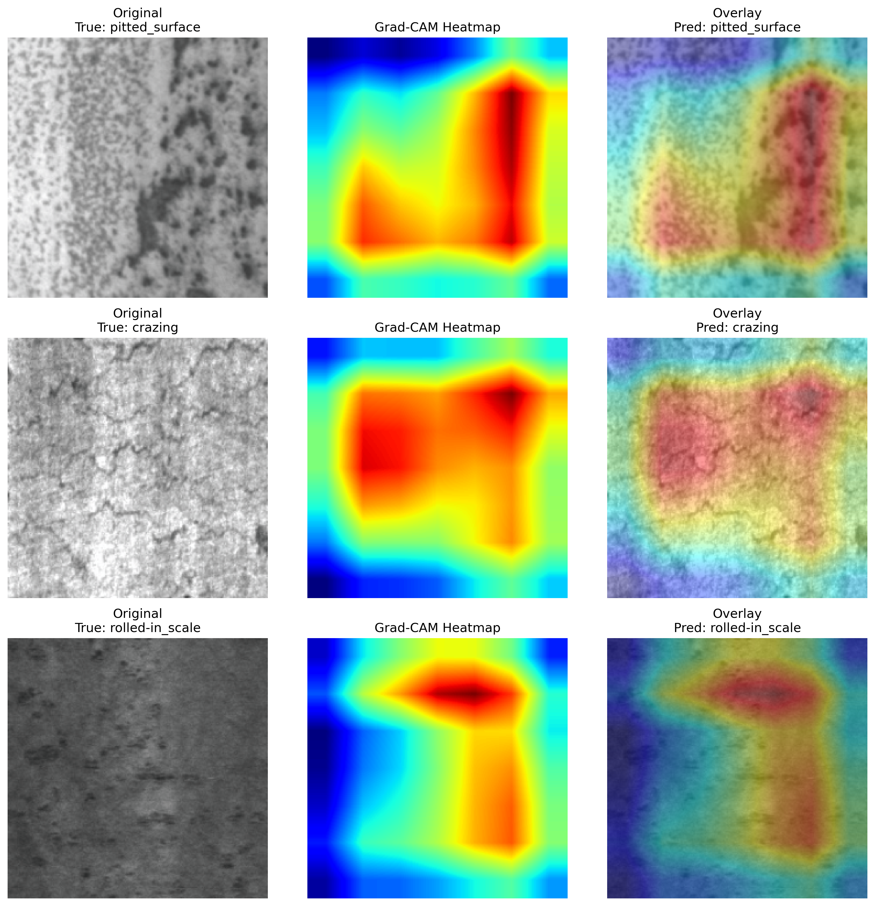
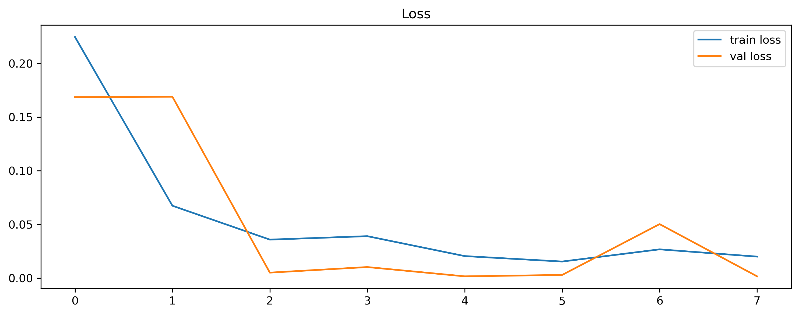
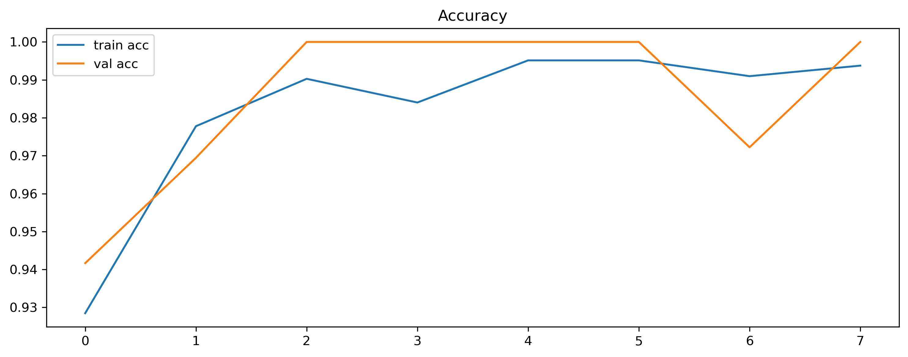

# CS614 Final Project  
## AI Industrial Quality Inspector

Computer vision system for **automated industrial surface defect detection** using **transfer learning and explainable AI**.

The project trains a **ResNet18 convolutional neural network** to classify steel surface defects and uses **Grad-CAM** to visualize the regions influencing model predictions.

---

# Overview

Manual inspection of industrial surfaces is often:

- slow
- inconsistent
- difficult to scale

This project demonstrates a **deep learning proof-of-concept** that can automatically classify surface defects and highlight the image regions responsible for the prediction.

The system combines:

- **Transfer Learning (ResNet18)**
- **PyTorch deep learning framework**
- **Grad-CAM explainable AI visualizations**

---

## Example Results

### Grad-CAM Explainability

The Grad-CAM visualization highlights the image regions that most strongly influenced the model's prediction.



### Training Performance

Training curves showing model convergence.





---

# Objective

Build a **multi-class image classification system** capable of identifying manufacturing defects from surface images and generating interpretable visual explanations.

Key goals:

- Detect multiple types of industrial surface defects
- Apply **transfer learning** to improve performance with limited data
- Provide **explainable predictions using Grad-CAM heatmaps**

---

# Dataset

This project uses the **NEU Surface Defect Dataset**, which contains images of hot-rolled steel surface defects.

Because the dataset is large, it is **not stored in this repository**.

Download the dataset from:

http://faculty.neu.edu.cn/songkechen/zh_CN/zdylm/263270/list/index.htm

After downloading, place the dataset in:

```
data/raw/neu_surface_defects/
```

Expected structure:

```
data/raw/neu_surface_defects/NEU-DET/
    train/images/
    validation/images/
```

---

# Technical Approach

The project uses the following machine learning techniques:

- **Transfer Learning with ResNet18**
- Multi-class image classification
- **PyTorch** deep learning framework
- **Grad-CAM** for explainable AI visualization
- Confusion matrix evaluation and performance metrics

---

# Project Structure

```
CS614-AI-Industrial-Quality-Inspector
│
├── data/
│   └── raw/              (dataset – ignored by git)
│
├── notebooks/
│   ├── 01_data_exploration.ipynb
│   └── Final Project.ipynb
│
├── outputs/
│   ├── figures/          (training curves, confusion matrix, Grad-CAM)
│   └── models/           (trained model checkpoint)
│
├── requirements.txt
└── README.md
```

---

# Setup

Clone the repository:

```
git clone https://github.com/YOUR_USERNAME/CS614-AI-Industrial-Quality-Inspector.git
cd CS614-AI-Industrial-Quality-Inspector
```

Install dependencies:

```
pip install -r requirements.txt
```

---

# Running the Project

Open and run the notebook:

```
notebooks/Final Project.ipynb
```

The notebook performs the following steps:

1. Load and preprocess the dataset
2. Train a ResNet18 transfer learning model
3. Evaluate model performance
4. Generate confusion matrices and training curves
5. Produce Grad-CAM visualizations for model interpretability

---

# Results

The trained model demonstrates strong performance on the NEU defect dataset and produces interpretable Grad-CAM visualizations highlighting the regions responsible for predictions.

Example outputs include:

- Training loss and accuracy curves
- Confusion matrix
- Example predictions
- Grad-CAM heatmaps

Generated figures are saved in:

```
outputs/figures/
```

---

# Author

**Roy Phelps**  
Drexel University  
CS614 – Applications of Machine Learning
